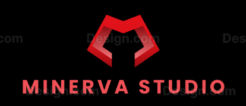

# MINERVA STUDIO



## Panoramica

Minerva Studio è una piattaforma integrata per l'organizzazione efficiente di idee, progetti e documentazione. L'applicazione è progettata per aiutare professionisti e team a gestire il proprio flusso di lavoro, mantenere traccia delle annotazioni e monitorare l'avanzamento dei progetti attraverso statistiche e suggerimenti personalizzati.

## Caratteristiche Principali

- **Gestione Note**: Crea, modifica e organizza annotazioni con sistema di versionamento automatico
- **Gestione Progetti**: Definisci e monitora progetti, assegnando note specifiche a ciascun progetto
- **Datasheet Progetto**: Genera documentazione strutturata a partire dalle note dei tuoi progetti
- **Analisi Avanzata**: Visualizza statistiche e ricevi suggerimenti personalizzati per migliorare la tua produttività
- **Interfaccia Mobile-First**: Design responsive ottimizzato per l'utilizzo su qualsiasi dispositivo

## Tecnologie Utilizzate

- **Frontend**: React.js, Material-UI
- **Stile**: CSS-in-JS con Material-UI theming
- **Build Tool**: Vite
- **Persistenza Dati**: LocalStorage (client-side storage)
- **Integrazione IA**: OpenAI API per la generazione di README

## Requisiti di Sistema

- Node.js (v14+)
- NPM (v6+) o Yarn

## Installazione

```bash
# Clona il repository
git clone https://github.com/tuouser/minerva-studio.git

# Entra nella directory del progetto
cd minerva-studio

# Installa le dipendenze
npm install

# Avvia il server di sviluppo
npm run dev
```

## Utilizzo

### Autenticazione

Per accedere all'applicazione, utilizza le seguenti credenziali:
- **Username**: raffaele.santone@metodi.pro
- **Password**: MinervaStudio

### Funzionalità Principali

1. **Dashboard**: Visualizza le statistiche principali e accedi rapidamente alle funzionalità
2. **Progetti**: Crea e gestisci progetti, assegna stati e monitora l'avanzamento
3. **Note**: Crea annotazioni dettagliate e associale a progetti specifici
4. **Datasheet Progetto**: Genera documentazione strutturata a partire dalle note dei progetti
5. **Analisi**: Visualizza statistiche dettagliate e ricevi suggerimenti per migliorare la tua organizzazione

## Struttura del Progetto

```
minerva-studio/
├── public/               # File statici (logo, favicon)
├── src/
│   ├── components/       # Componenti React
│   │   ├── Dashboard.jsx # Dashboard principale
│   │   ├── Header.jsx    # Barra di navigazione
│   │   ├── Login.jsx     # Schermata di login
│   │   ├── NoteEditor.jsx # Editor di note
│   │   ├── NoteList.jsx  # Lista delle note
│   │   ├── ProjectManager.jsx # Gestione progetti
│   │   └── ...
│   ├── services/         # Servizi e API
│   │   └── openaiService.js # Integrazione con OpenAI
│   ├── App.jsx           # Componente principale
│   ├── main.jsx          # Entry point
│   └── index.css         # Stili globali
├── package.json          # Dipendenze e script
└── vite.config.js        # Configurazione Vite
```

## Persistenza dei Dati

L'applicazione utilizza il localStorage del browser per la persistenza dei dati. Questo significa che:
- I dati sono salvati localmente sul dispositivo
- I dati non vengono sincronizzati tra dispositivi diversi
- Cancellando la cache del browser si rimuoveranno i dati salvati

## Limitazioni Note

- L'applicazione funziona solo in modalità online
- I dati sono salvati solo sul dispositivo corrente e non sono sincronizzati tra dispositivi
- L'integrazione con OpenAI richiede una connessione internet attiva

## Sviluppi Futuri

- Implementazione di un backend per la sincronizzazione dei dati tra dispositivi
- Funzionalità di esportazione/importazione dati
- Collaborazione in tempo reale
- Integrazione con servizi di cloud storage
- Modalità offline con sincronizzazione

## Contribuire

Le contribuzioni sono benvenute! Per contribuire al progetto:

1. Forka il repository
2. Crea un branch per la tua feature (`git checkout -b feature/AmazingFeature`)
3. Committa le tue modifiche (`git commit -m 'Add some AmazingFeature'`)
4. Pusha il branch (`git push origin feature/AmazingFeature`)
5. Apri una Pull Request

## Licenza

Questo progetto è distribuito con licenza [MIT](LICENSE).

## Contatti

Minerva Studio è un prodotto di **Metodi.Pro**

Email: raffaele.santone@metodi.pro